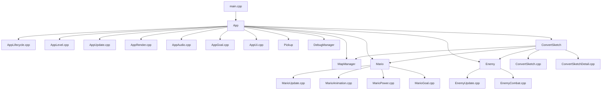

# 2026 OOPL Final Report

## Group Information

Group: 56

Members:
- 113590033 曾衡昌
- 113590040 應尼歌

Recreated Game:
Super Mario Bros.

## Project Overview

### Game Overview
**Super Mario Bros.** is a classic side scrolling platform game where players control Mario, jump over or defeat enemies, collect coins and power ups, and reach the flagpole to clear each level.

For this project, we recreated **World 1-1, World 1-2, and World 1-3**. These three stages provide different gameplay experiences. **World 1-1** acts as an introductory stage that teaches the player basic movement, jumping, block interaction, and enemy encounters. **World 1-2** is an underground level with a larger map, more obstacles, and transition-based exploration. **World 1-3** is a platform-focused stage that requires more precise jumping and timing.

The enemies featured in these stages include **Goombas, Green Koopas, Red Koopas, winged Red Koopas, and Venus**. Different enemy placements and terrain layouts create different challenges in each level. Players can also collect coins and hit question blocks to obtain rewards such as **coins, mushrooms, stars, and 1UP mushrooms**. These pickups improve survivability, increase score, and add variety to gameplay progression.

For debugging and testing purposes, the game includes several built in debug functions. Pressing **F1** opens the debug overlay during gameplay, **F2** toggles God Mode, **F3** enables Free Camera, **F4** cycles Mario's power state, **F5** enables Fly Mode, **F6** spawns a mushroom, **F7** spawns a star, **F8** opens the warp menu, and **F9** minus (-50) to the timer.

### Group Work Division

| Member | Student ID | Main Responsibilities |
|------|------|------|
| 曾衡昌 | 113590033 | Core gameplay systems, collision and level flow logic, goal sequence implementation, gameplay tuning, testing/polishing, gameplay feature integration |
| 應尼歌 | 113590040 | Level conversion pipeline, map and resource integration, UI and debug presentation, Mario and enemy behavior |

## Game Introduction

### Game Rules
The recreated game follows the classic side scrolling Mario formula.

1. The player starts from the title screen and enters the level.
2. Mario moves left and right, jumps, crouches, and interacts with the environment.
3. Coins can be collected for score, and repeated coin collection also contributes toward extra rewards.
4. Question blocks can produce rewards such as coins, mushrooms, stars, and 1UP mushrooms.
5. Mario can power up from Small Mario to stronger forms depending on the collected item.
6. Enemies such as Goombas, Koopas, winged red Koopas, and Venus must be avoided or defeated.
7. Mario can defeat many enemies by stomping, kicking shells, or using fireballs.
8. If Mario is hit without protection, falls out of the stage, or runs out of time, he loses a life.
9. Reaching the flagpole triggers the goal sequence and awards bonus points based on the remaining time.
10. The game also supports transitions between outdoor and underground sections.

### Game Screens
Based on the current project resources and scene logic, the game includes the following main screens:

- **Title screen** with animated coin graphics, cursor, logo, and start prompt.
- **Level intro screen** showing world and life information before gameplay starts.
- **Main gameplay screen** with HUD elements such as score, world, time, and coin count.
- **Goal sequence scene** after touching the flagpole and entering the castle.

## Program Design

### Program Architecture
This project is built with an object oriented structure centered on scene control, map handling, and gameplay entities.

Main architectural responsibilities:

- **`App`** is the top level controller. It manages the main game flow from title screen to level intro, gameplay, and goal completion. It also coordinates level loading, audio, UI, score, lives, timer, and object updates.
- The `App` logic is further separated by responsibility:
  - `AppLifecycle.cpp` handles startup and initialization.
  - `AppLevel.cpp` handles loading levels, loading scene sketches, underground transitions, and resetting stage related state.
  - `AppUpdate.cpp` handles the main gameplay update loop, collisions, pickup collection, enemy interaction, fireball usage, timer updates, and pause/debug input integration.
  - `AppRender.cpp` handles scene drawing, HUD rendering, and debug rendering.
  - `AppAudio.cpp` manages music and sound effects.
  - `AppGoal.cpp` handles the flagpole and castle goal sequence.
  - `AppUi.cpp` builds and refreshes HUD and title/intro text presentation.
- **`MapManager`** manages stage size, tile placement, collision boxes, moving platforms, theme switching, and map related queries such as goal position and pipe entry points.
- **`Mario`** is the player character class. It handles movement, jumping, power states, death, fireball spawn positions, and the goal sequence animation/state changes.
- The Mario system is also split into focused modules:
  - `Mario.cpp` stores core shared behavior and common data access.
  - `MarioUpdate.cpp` handles movement, physics, and per frame state updates.
  - `MarioAnimation.cpp` manages sprite changes based on movement and state.
  - `MarioPower.cpp` manages power state transitions and damage handling.
  - `MarioGoal.cpp` handles the special goal sequence behavior after reaching the flagpole.
- **`Enemy`** handles multiple enemy types through a shared class with type based behavior, including Goombas, Koopas, winged Koopas, shell states, and Venus enemies.
- The enemy system is separated into `Enemy.cpp`, `EnemyUpdate.cpp`, and `EnemyCombat.cpp`, which helps isolate movement/state logic from combat results such as stomping, shell behavior, and defeat handling.
- **`Pickup`** manages collectible items and rewards, including mushrooms, stars, 1UPs, and coin pop behavior from question blocks.
- **`DebugManager`** manages the debug overlay, hitbox drawing, warp menu, free camera, god mode, fly mode, and other testing tools.
- **`ConvertSketch`** converts level sketch images into actual gameplay data, including tiles, background theme, question block content, pipes, moving platforms, enemy spawns, and Mario spawn position.
- `ConvertSketch.cpp` and `ConvertSketchDetail.cpp` form a dedicated level conversion subsystem, separating the main conversion flow from detailed color rules and helper logic.
- **`GameImage` / `GameTexture`** provide local image and texture handling used by rendering objects in the game.

This structure keeps scene logic, level data, and gameplay objects separated enough to make the project easier to maintain and extend.

### Program Techniques
The current codebase shows several important implementation techniques:

**1. Object oriented design**
- The project separates responsibilities into classes such as `App`, `Mario`, `Enemy`, `Pickup`, `Fireball`, `MapManager`, and `DebugManager`.
- State specific logic is distributed into multiple source files such as `AppUpdate.cpp`, `AppRender.cpp`, `AppLevel.cpp`, and `AppGoal.cpp`, which keeps the main structure clearer.

**2. State driven game flow**
- The game uses screen states such as `Title`, `LevelIntro`, `Gameplay`, `Paused`, `StatusMessage`, and `TransitionScene`.
- Mario also has internal state systems for power, movement, and goal progression.
- Enemies use state transitions for walking, shell behavior, recovery, and death.

**3. Data conversion from sketch images**
- `convert_sketch(...)` loads a sketch image with SDL image utilities and converts color coded pixels into actual stage content.
- This includes tiles, underground theme detection, question block loot settings, pipes, platforms, background objects, and enemy spawn generation.
- This approach makes level design more visual and easier to edit than hard coded maps.

**4. Resource driven rendering**
- Many game elements are assembled from sprite assets under `Resources/image`, including Mario animations, enemies, blocks, underground graphics, title assets, and font sprites.
- The HUD and debug overlay are rendered with image based glyphs rather than standard text rendering alone, which helps maintain a retro game style.

**5. Memory safe ownership design**
- The project uses `std::unique_ptr`, `std::shared_ptr`, and STL containers heavily for object ownership and lifecycle control.
- Dynamic objects such as enemies, pickups, fireballs, and debris are stored in managed containers and erased when expired, which helps reduce memory management risk.

### Use of AI / AI Agent
We used **Codex** as an AI coding assistant during development.

The most meaningful AI assisted part was around the **`ConvertSketch` pipeline** and related integration work. Because `ConvertSketch` connects image parsing, tile conversion, background setup, enemy spawn generation, and stage specific rule handling, it was one of the more complex parts of the project to reason about. Codex helped us inspect the existing code, trace how the conversion logic was connected to `App` and `MapManager`, and support adjustments more quickly.

We also used Codex to help inspect and refine parts of the debug workflow, such as restoring the debug overlay behavior and restricting when it can be opened. The AI was used as a development assistant, while the project decisions and final integration still depended on our own review and testing.

## Conclusion

### Problems and Solutions
During the development process, several practical problems appeared.

**1. Complex level setup**
- Problem: Writing an entire Mario stage directly in code would be slow and difficult to maintain.
- Solution: The project uses `convert_sketch(...)` to interpret sketch images and generate map tiles, background settings, and enemy placement automatically.

**2. Coordinating multiple gameplay systems**
- Problem: Player movement, enemies, collisions, pickups, fireballs, and goal logic all need to work together without breaking scene transitions.
- Solution: The project separates the logic into specialized files such as `AppUpdate.cpp`, `AppLevel.cpp`, `AppGoal.cpp`, and entity specific classes, which improves readability and reduces chaos.

**3. Testing gameplay efficiently**
- Problem: Reaching a specific part of the level repeatedly is inefficient when testing game behavior.
- Solution: The debug system provides overlay information, warp options, and special testing abilities that make development and verification much faster.

**4. Managing dynamic objects safely**
- Problem: A game project creates and removes many objects during play, which can easily cause ownership bugs.
- Solution: The code uses smart pointers and container cleanup patterns to manage objects such as enemies, pickups, fireballs, and debris more safely.

### Self Evaluation

| Item No. | Item | Status |
|------|------------------------|-------|
| 1 | Repository visibility changed to public | Yes |
| 2 | Debug mode feature implemented | Yes |
| 3 | All memory leak issues resolved | Yes (Designed with smart pointer based ownership) |
| 4 | No typo or missing section in the report | Yes |
| 5 | Report keeps a basic readable style | Yes |

### Reflection
This project was a valuable exercise in combining object oriented programming with real game logic. Recreating Super Mario Bros. required more than only drawing sprites; it also required handling state transitions, collision rules, enemy behavior, scoring, power ups, map parsing, and scene management in a consistent way.

One important lesson from this project is that a clear structure matters a lot in game development. When the logic for level loading, gameplay updates, rendering, and debugging is separated well, it becomes much easier to continue improving the project without breaking everything else. Another lesson is that internal development tools such as debug overlays are extremely useful and can save a large amount of testing time.

### Contribution Ratio

| No. | Department | Student ID | Name | Contribution Ratio |
|------|------|------|------|------|
| 1 | Computer Science | 113590033 | 曾衡昌 | 50% |
| 2 | Computer Science | 113590040 | 應尼歌 | 50% |
